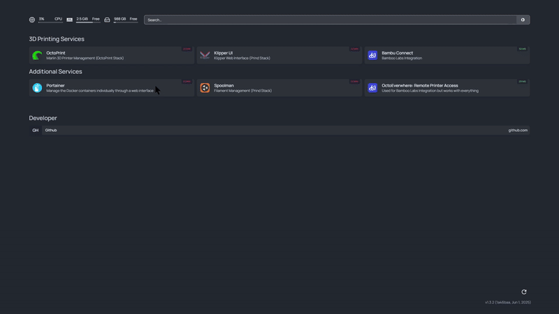

# Print Hub - Centralized 3D Printing Dashboard

<p align="center">
  
  
  
  
</p>

A Docker-based solution that provides a centralized dashboard for managing multiple 3D printing services including OctoPrint, Klipper (Fluidd/Mainsail), and Bamboo Labs integration.



## Features

- **Centralized Dashboard**: Homepage-based UI displaying all available services

- **Multiple Printer Support**: Supports OctoPrint and Klipper-based setups

- **Modular Design**: Uses git submodules for external printer stacks

- **Easy Access**: Single entry point with automatic service discovery

- **Little Modification Required**: Works with stock configurations of submodules

- **Included:** Klipper Host, Octoprint Marlin Host, OctoEverywhere Bambu Connect, Portainer, Nginx, and Homepage

## Motivation

Additional Computers can be used to provide additional utility to existing printers (Marlin) or take a step further by using custom printer firmware to achieve better utility than stock MCU firmware. This is typically done with a raspberry pi, however, it can get tedious to set up one or both of these solutions and come with its risks (a power outage to a non UPS'd pi can cause bad times 🧱). This docker deployment has a Mainsail flavour of Klipper you can use or an Octoprint setup (or both) with automated setup and nice subdomains on your network.

There are a few ways to manage the running containers and automate its deployment. A simple docker-based startup is included and recommended, feel free to combine this with something like Portainer for a remote management.

### Klipper Based Printers (Custom MCU Firmware)

If you already have klipper firmware on the MCU of your printer, you probably already know how this works and want the benefits you get from having it dockerized. If you are unfamiliar with what this is, consider seeing if your printer can easily switch and if you like the benefits (There are tons!)

There is an included version of mainsail flavour klipper software that was tested to run on Ubuntu based machines. Please view the setup for detailed instructions.

### Marlin Based Printers (Usually the default firmware your printer has)

If you are unsure what your printer has, it is likely Marlin based. There is nothing wrong with Marlin, but if you know the benefits of Klipper and don't want to (or can't) switch out of Marlin, then octoprint is likely the best option for you. With this setup, you can use pretty much everything octoprint has, but it's nicely kept in this container.

### Bambu Connect

There is also an option to use bambu Connect via Octoeverywhere, a great remote solution that offers great free plan. There are additional features such as more framerate cameras opossed to the 1fps cameras on some Bambulab printers.

# Setup

## Automated Setup

You can pull a tagged version of this dirrectly from dockerhub! Coming soon...

## Manual Setup

Note: this was tested using Debian based machines (Particularly a Raspberry PI 3B+ with Raspberry Pi OS Lite, feel free to use this). I will assume this setup for the guide, but it should be nearly identical with whatever distro you are using.

### 🔧 Raspberry Pi setup

There are tons of guides for this. I will summarize what is important if you are unfamiliar.

1.  Use Raspberry Pi Imager and flash **Raspberry Pi OS Lite (64-bit)**. This is best for pi hardware and is very light, we will be using a terminal only OS since we will never have to deal with it outside of initial setup
2.  Before ejecting the SD card (On Windows make sure you keep LF line breaks):

    - Create a file called `ssh` (no extension) in the `/boot` partition to enable SSH.
    - Create a `wpa_supplicant.conf` file in `/boot`:

>         country=CA
>         ctrl_interface=DIR=/var/run/wpa_supplicant GROUP=netdev
>         update_config=1
>
>         network={
>           ssid="YourWiFi"
>           psk="YourPassword"
>         }

Make sure you do not use DHCP and keep a fixed IP from your modem's dashboard if you want easier SSH access (We will use the subdomains to access the printer interfaces regardless)

3. **Please note:** There may be issues connecting to wifi on your pi, this is usually due to necessary declarations needed in config that may not be fully covered by your wpa_supplicant/setup. If you boot your pi and you cannot connect (you cannot run this command `ping 8.8.8.8`), then follow any setup it asks, run `sudo raspi-config` and fill out **Localisation Options**. After do `sudo reboot now`, then re-enter your wifi credentials under **System Options** of raspi-config, you should have no issues with connecting again.

### 🔧 First time setup and Docker install

1.  SSH into the Pi:

`ssh pi@<your-raspberry-pi-ip>`

2. Update everything:

`sudo apt update && sudo apt full-upgrade -y`

3. Install basic tools:

`sudo apt install git ca-certificates curl wget nano avahi-daemon -y`

4. Install Docker. It is best to follow your specific docker guide which you can find [here](https://docs.docker.com/engine/install/), I will provide what is expected for [Raspberry Pi OS 64-bit](https://docs.docker.com/engine/install/debian/)

Remove potentially bad existing installations:

```console
 for pkg in docker.io docker-doc docker-compose podman-docker containerd runc; do sudo apt-get remove $pkg; done
```

Install the proper way:

```bash
sudo install -m 0755 -d /etc/apt/keyrings
sudo curl -fsSL https://download.docker.com/linux/debian/gpg -o /etc/apt/keyrings/docker.asc
sudo chmod a+r /etc/apt/keyrings/docker.asc

# Add the repository to Apt sources:
echo \
  "deb [arch=$(dpkg --print-architecture) signed-by=/etc/apt/keyrings/docker.asc] https://download.docker.com/linux/debian \
  $(. /etc/os-release && echo "$VERSION_CODENAME") stable" | \
  sudo tee /etc/apt/sources.list.d/docker.list > /dev/null
sudo apt-get update
```

```console
sudo apt-get install docker-ce docker-ce-cli containerd.io docker-buildx-plugin docker-compose-plugin
```

6. Reboot:
   `sudo reboot now`

## 🔧 Container Setup and Run Instructions

1. Create a new folder for your containers

```bash
mkdir ~/containers && cd ~/containers
```

2. Pull this repo

```bash
git clone --recurse-submodules https://github.com/matias-io/print-hub && cd print-hub
```

3. Follow `Folder Structure and making custom-builds` and `Configuation` to set up your desired servers and how they are setup.
4. First time run script (from project directory)

```bash
chmod  +x  start.sh
./start.sh
```

5.  **Access the dashboard:**

- Main Dashboard: `http://<your-pi-ip>`

### 🔧 Folder Structure and making custom-builds.

```

print-hub/

├── docker-compose.yml # Main dashboard and proxy

├── start.sh # Startup script

├── config/ #Setup the routing and Dashboard

│ ├── homepage/ # Dashboard configuration

│ └── nginx/ # Reverse proxy config

├── external/ # Git submodules (don't modify)

│ ├── octoprint/ # OctoPrint stack  (don't modify, only setup docker-compose)

│ └── prind/ # Klipper stack (Fluidd/Mainsail)  (don't modify, only setup docker-compose, UI chosen in start.sh )

└── internal/ # Internal services (don't modify, only setup docker-compose)

└── bamboo-connect/ # Bamboo Labs integration

```

**IMPORTANT: ** In order to keep submodules in `external` and not have to fork a repo, it is necessary to do two changes to use the octoprint and klipper.

- **Octoprint** (/external/octoprint/docker-compose.yaml)
  You must use port 100 for this

```yaml
ports:
  - 100:80
```

- **Klipper**
  (/external/prind/docker-compose.yaml)

```yaml
traefik:

image: traefik:3.4

command:
  - "--accesslog"

  - "--providers.docker=true"

  - "--providers.docker.exposedbydefault=false"

  - "--entrypoints.web.address=:80"

ports:
  - "200:80"
```

(/external/prind/docker-compose.override.yaml) - Comment this section out until you have the correct device ready to explicitly write in

```yaml
# ## Add your personal config here

# services:

# webcam:

# <<: *ustreamer-svc

# devices:

# - /dev/video0:/dev/webcam

# labels:

# org.prind.service: webcam

# traefik.enable: true

# traefik.http.services.webcam.loadbalancer.server.port: 8080

# traefik.http.routers.webcam.rule: PathPrefix(`/webcam`)

# traefik.http.routers.webcam.entrypoints: web

# traefik.http.middlewares.webcam.stripprefix.prefixes: /webcam

# traefik.http.routers.webcam.middlewares: webcam
```

## Configuration

### Homepage Dashboard

Edit files in `config/homepage/` to customize:

- `services.yaml`: Add/remove services and their URLs

- `settings.yaml`: Customize appearance and layout

- `docker.yaml`: Docker integration settings

### Adding New Services

1. Add the service to your `docker-compose.yml` or submodule

2. Update `config/homepage/services.yaml` with the new service details

3. Restart the dashboard: `docker compose restart homepage`

### Changing Active Profiles

Edit `start.sh` to modify which Prind profiles are active (or comment out their docker compose files and execution from `start.sh`:

```bash

# Examples:

docker  compose  --profile  fluidd  up  -d  # Fluidd only

docker  compose  --profile  mainsail  up  -d  # Mainsail only

docker  compose  --profile  fluidd  --profile  spoolman  up  -d  # Multiple services
```

### Reference

You can now fully set up each service, you can find their respective documentations below

- **Klipper (Prind)** | https://github.com/mkuf/prind
- **Octoprint** | https://hub.docker.com/r/octoprint/octoprint
- **Bambu Connect** | https://octoeverywhere.com/bambu?
- **Hompage Dashboard** | https://gethomepage.dev/widgets/
- **Portainer** | https://docs.portainer.io/start/install-ce/server/setup , This should be pretty much plug and play

You can now go back to `Container Setup and Run Instructions` and run your services.

### ✅ Finishing touches

You can access these network-bound addresses anywhere on the internet using a free service such as octoeverywhere for all services included. We can also setup a tunnel service dirrectly by enabling the container (Coming soon)

> Consider supporting and checking out the open source projects included with these container if you can, they do very cool stuff 😎
